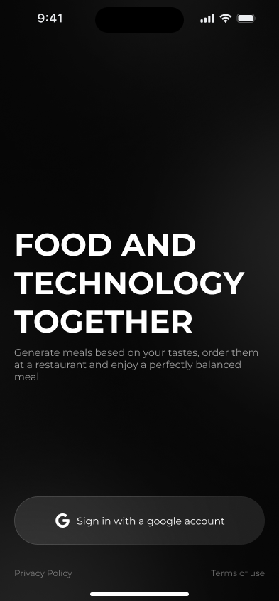

# Client applications for Android and iOS

### Welcome page

<figure><figcaption>
Welcome page
</figcaption></figure>

**Main Purpose:** Introduce the app and offer the user the option to sign up or log in.

**Features:**

* Title: _"Food and Technology Together"_. Highlights the unique concept of combining technology and food.
* Subtitle: A brief description of how the app helps create personalized meals.
* Login Button: Google account authentication.
* Links: Privacy Policy and Terms of Use.

### AI Dish Builder Screen

<figure><figcaption>
AI dish builder screen
</figcaption></figure>

**Main Purpose:** Personalize the user’s diet based on calorie intake, macronutrients (protein, fats, and carbs), and preferences.

**Features:**

* Title: _"AI Dish Builder"_.
* Input Parameters: Specify daily calorie intake and nutrition goals (e.g., muscle gain, weight loss, etc.).
* Nutrition Plan Card: Displays the current meal plan with active ingredients (e.g., _My Plan_ showing macronutrient proportions of 20/60/20).
* Calorie Slider: Allows users to set their target calorie intake (e.g., 800 kcal).
* _Generate_ Button: Generates meals automatically based on input parameters.
* Custom Requests: Users can add specific preferences through the _"Anything in particular?"_ button.

### **Dish Suggestions Screen**

<figure><figcaption>
Dish Suggestions Screen
</figcaption></figure>

* **Main Purpose:** Provide users with a selection of suggested meals that match their parameters and preferences.
* **Features:**
  * Meal List: Displayed as cards with images and details.
  * Card Information:
    * Dish name (e.g., _Fishy and sweet_).
    * Price (e.g., _150,000 VND_).
    * Macronutrient proportions and calories based on the chosen plan.
  * Add to Cart: Option to add a meal to the cart via a "+" button.
  * _Generate_ Button: Refreshes the list of meal suggestions.
  * Custom Requests Field: Users can refine their preferences (_"Anything in particular?"_).
